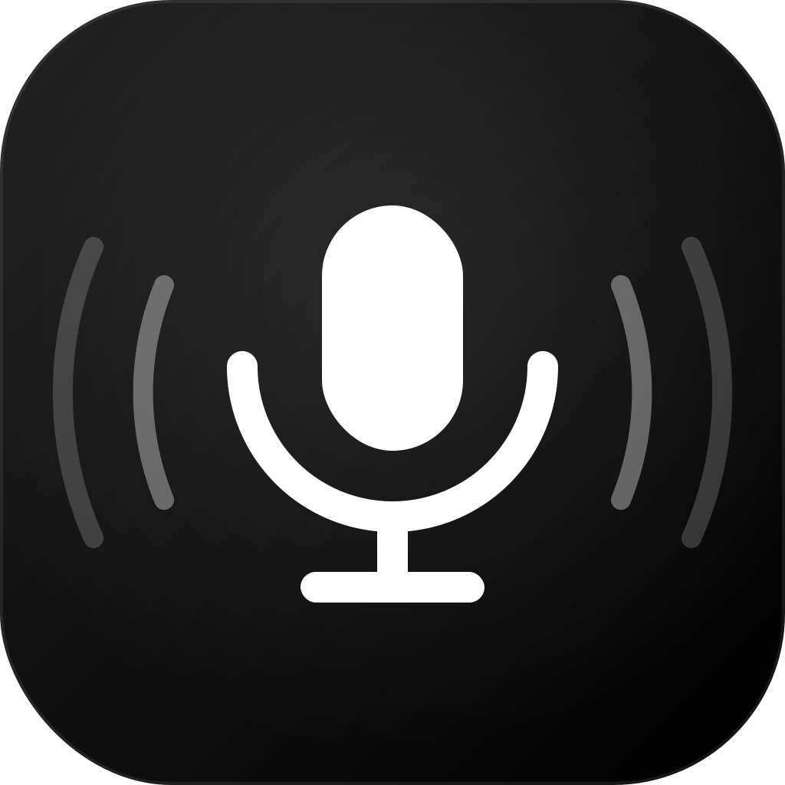

<p align="center">
  
</p>

<h1 align="center">Local Murmur</h1>
<p align="center"><strong>Wispr Flow Clone for Apple M4</strong></p>

A fully local, free voice dictation tool that works in **every app** on your Mac.
Supports **Hinglish** (Hindi + English), cleans filler words via Ollama, and pastes polished text wherever your cursor is.

---

## What you get

| Feature | How |
|---|---|
| Global hotkey (hold Right Option) | `pynput` |
| Fast transcription | `whisper.cpp` with Metal (Neural Engine) |
| Choice of model — Tiny to Large v3 | Pick & download in Settings → Models |
| Filler word cleanup | `Ollama` + `llama3.2` (local, private) |
| Auto-paste anywhere | AppleScript `Cmd+V` injection |
| Runs 100% offline | No API keys, no subscriptions |

---

## Installing the app (DMG)

The DMG ships **without** a transcription model — it stays small and fast to
download. `whisper-cli` (with Metal support) is already bundled inside the app.

1. Open the DMG and drag **Local Murmur** to **Applications**.
2. Launch it. On first run, the Settings window opens straight to **Models**.
3. Pick a model and hit **Download** — sizes range from ~75 MB (Tiny) to
   ~2.9 GB (Large v3), with a live progress bar.
4. Once downloaded, the model activates automatically and you're ready to
   dictate (hold Right Option).

You can come back to **Settings → Models** anytime to download additional
models, switch the active one, or delete models you no longer need to free
up disk space.

| Model | Size | Speed | Accuracy | Best for |
|---|---|---|---|---|
| Tiny | ~75 MB | Fastest | Basic | Quick English notes |
| Base | ~142 MB | Very fast | Good | Everyday dictation |
| Small | ~466 MB | Fast | Great | **Recommended** — balanced |
| Medium | ~1.5 GB | Moderate | Excellent | Hinglish & mixed languages |
| Large v3 Turbo | ~1.6 GB | Fast | Excellent | Large-model accuracy, faster |
| Large v3 | ~2.9 GB | Slow | Best | Maximum accuracy, any language |

---

## Running from source (developers)

The steps below are only needed if you're running `flow.py` directly with
Python instead of the packaged app.

## Setup (one time)

```bash
chmod +x setup.sh
./setup.sh
```

This will:
1. Install Homebrew (if needed)
2. Clone & build `whisper.cpp` with Metal support
3. Download the `medium` Whisper model (~1.5 GB) as a starting point
4. Install Python deps: `sounddevice`, `numpy`, `pynput`
5. Install Ollama + pull `llama3.2`

> Running from source still uses the same in-app **Settings → Models** picker —
> you can switch to any other model size at any time without re-running Setup.sh.

---

## macOS Permissions (required)

Go to **System Settings → Privacy & Security** and allow **Terminal** (or your Python launcher) for:

- ✅ **Microphone** — to capture your voice
- ✅ **Accessibility** — to simulate Cmd+V paste
- ✅ **Input Monitoring** — to detect the hotkey globally

> You'll be prompted automatically on first run.

---

## Running

**Terminal 1** — start Ollama in the background:
```bash
ollama serve
```

**Terminal 2** — start Flow:
```bash
python3 ~/flow.py
```

Then **click into any app** (Slack, browser, Notes, VS Code…) and:

- **Hold Right Option** → recording starts (beep 🔔)
- **Release Right Option** → recording stops, transcribes + cleans, pastes

---

## Auto-start on login (optional)

1. Edit `com.localmurmur.dictation.plist` — replace `YOUR_USERNAME` with your actual username
2. Copy to LaunchAgents:
```bash
cp com.localmurmur.dictation.plist ~/Library/LaunchAgents/
launchctl load ~/Library/LaunchAgents/com.localmurmur.dictation.plist
```

---

## Customisation

Edit `flow.py` top section:

```python
HOTKEY       = "right_option"   # change hotkey if you want
OLLAMA_MODEL = "llama3.2"       # swap to mistral, gemma3, etc.
SOUND_START  = True             # set False to disable beeps
```

### Switch to a faster (or more accurate) model
Open **Settings → Models**, download the model you want, then click
**Use this model**. No code edits or restarts needed — the next dictation
uses the newly selected model. `small`/`base` are faster; `medium`/`large-v3`
are more accurate for Hinglish.

---

## Performance on M4 (24 GB)

| Model | Transcription speed | Hinglish accuracy |
|---|---|---|
| `large-v3` | ~2–4s for 30s audio | ⭐⭐⭐⭐⭐ |
| `medium` | ~0.8–1.5s for 30s audio | ⭐⭐⭐⭐ |
| `small` | ~0.4s for 30s audio | ⭐⭐⭐ |

Your M4 with 24 GB can comfortably run `large-v3` + `llama3.2` simultaneously.

---

## Troubleshooting

**"Nothing heard" every time**
→ Check Microphone permission in System Settings

**Paste doesn't work**
→ Check Accessibility permission

**Hotkey not detected**
→ Check Input Monitoring permission

**Ollama error**
→ Make sure `ollama serve` is running in another terminal

**Whisper not found**
→ (Source/dev mode) Re-run `Setup.sh`, or check `~/whisper.cpp/build/bin/whisper-cli` exists.
  The packaged app bundles `whisper-cli` already — if you see this in the app, reinstall it.

**"No model installed" / dictation does nothing**
→ Open **Settings → Models** and download a model — Local Murmur needs at least
  one model installed to transcribe.

---

## Cost

| Component | Cost |
|---|---|
| whisper.cpp | Free & open source |
| large-v3 model | Free (OpenAI released weights) |
| Ollama | Free |
| llama3.2 | Free (Meta released weights) |
| **Total** | **$0/month** |
